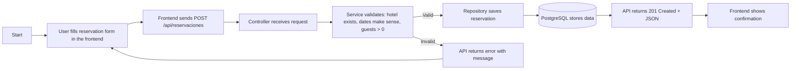
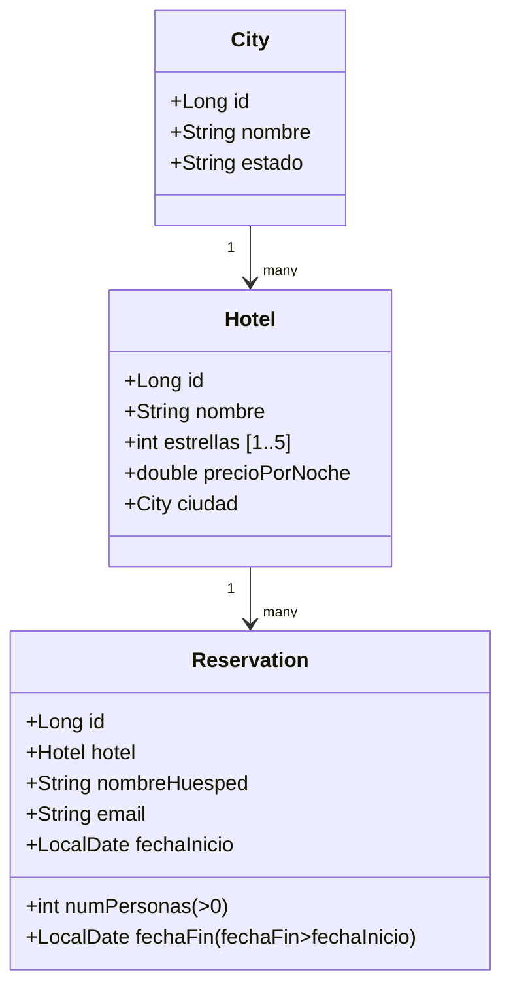

# 🏨 BookingMx Hotel Reservation Platform

# BookingMx — Sprint 1 (JUnit + API + DB + Postman + JaCoCo)

## Table of Contents
1. Project Overview
2. Sprint 1 Objectives and Deliverables
3. System Architecture
4. Requirements / Tech Stack
5. Installation & Configuration
6. Database Schema (Flyway)
7. API Endpoints (with examples)
8. Testing: JUnit, MockMvc & JaCoCo
9. Evidence & Screenshots
10. Rubric Alignment — Achieving C2 Level
11. Best Practices and Technical Decisions
12. Commit History Summary
13. Contribution Guidelines

---

## 1) Project Overview
**BookingMx** is a backend implementation for a hotel booking system.  
In Sprint 1, we focused on creating robust unit tests and backend architecture using Java and Spring Boot. The project includes entities (`City`, `Hotel`, `Reservation`), repositories, service logic with validations, REST controllers, database migrations via Flyway, a Postman collection, and JUnit tests.  
JaCoCo ensures **≥90% coverage**, validating software quality and testing completeness.

---

## 2) Sprint 1 Objectives and Deliverables
- Design and implement the data model (`City`, `Hotel`, `Reservation`)
- Create and version the PostgreSQL schema using Flyway
- Develop REST endpoints for CRUD and booking creation
- Test all endpoints using Postman
- Implement unit and integration tests using **JUnit** and **MockMvc**
- Configure **JaCoCo** with a minimum 90% coverage rule
- Produce detailed documentation aligned with the evaluation rubric

---

## 3) System Architecture


**Folder Structure:**

```bash
src/
 ├─ main/java/com/bookmx/
 │   ├─ api/           # Controllers
 │   ├─ api/dto/       # DTOs (Requests/Responses)
 │   ├─ domain/        # JPA Entities
 │   ├─ repository/    # Repositories
 │   └─ service/       # Business Logic
 └─ resources/
     ├─ application.properties
     └─ db/migration/V1__init.sql
src/test/              # Unit Tests & MockMvc
```

---

## 4) Requirements / Tech Stack
**Language:** Java 17+  
**Frameworks:** Spring Boot, Spring Data JPA, Spring Validation  
**Database:** PostgreSQL  
**Migration Tool:** Flyway  
**Testing:** JUnit 5, Mockito, MockMvc, JaCoCo  
**Tools:** Maven, Postman

---

## 5) Installation & Configuration

### Environment Variables
Do not hardcode credentials. Use environment variables instead:

```bash
export SPRING_DATASOURCE_URL=jdbc:postgresql://localhost:5432/bookingmx
export SPRING_DATASOURCE_USERNAME=booking_user
export SPRING_DATASOURCE_PASSWORD=securepassword
```

### Database Setup (Docker Example)
```bash
docker run --name booking-db -e POSTGRES_DB=bookingmx   -e POSTGRES_USER=booking_user -e POSTGRES_PASSWORD=securepassword   -p 5432:5432 -d postgres:15
```

### Run the Application
```bash
mvn clean package
mvn spring-boot:run
```
Flyway will automatically create the tables defined in `V1__init.sql`.

---

## 6) Database Schema (Flyway Migration)
Tables created:
- **city** — stores city names and states.
- **hotel** — linked to city with rating and price.
- **reservation** — linked to hotel, with constraints ensuring valid dates and guest info.

---

## 7) API Endpoints (with Examples)
**Base URL:** `http://localhost:8080/api`

### Create City
`POST /api/cities`
```json
{
  "name": "Toluca",
  "state": "Estado de México"
}
```

### Create Hotel
`POST /api/hotels`
```json
{
  "name": "Hotel Central",
  "city": {"id": 1},
  "stars": 4,
  "pricePerNight": 1200.5
}
```

### Create Reservation
`POST /api/reservations`
```json
{
  "hotelId": 1,
  "guestName": "Camila A. Uribe",
  "email": "cami@example.com",
  "numGuests": 2,
  "startDate": "2025-11-20",
  "endDate": "2025-11-22"
}
```

### List Reservations
`GET /api/reservations`

Collection exported to: `postman/BookingMx.postman_collection.json`

---

## 8) Testing: JUnit, MockMvc & JaCoCo

### Run Tests
```bash
mvn test
```

### Coverage Report
After running, open:
```bash
target/site/jacoco/index.html
```
Coverage goal: **≥ 90%** (enforced via Maven build rule).

### Tests Implemented
- `ReservationServiceTest` — verifies business logic and validation rules.
- `ReservationControllerTest` — validates endpoints using MockMvc.

**Use of Mockito** for dependency isolation and precise behavior testing.

**Example Scenarios**
✔ Valid reservation creation  
✔ Invalid date ranges rejected  
✔ Missing hotel throws exception  
✔ Controller returns correct HTTP status and JSON structure

---

## 9) Evidence & Screenshots
Store under `/docs/screenshots/`:

| # | Evidence Description                    | File Name                                                          | Notes                                                                                                                                     |
|---|-----------------------------------------|--------------------------------------------------------------------|-------------------------------------------------------------------------------------------------------------------------------------------|
| 1 | **JaCoCo Coverage Report (97%)**        |              | Visual proof of the coverage report generated by JaCoCo (`target/site/jacoco/index.html`), showing a total coverage of 97%.               |
| 2 | **Database Schema (Flyway Migration)**  |                        | Entity diagram for `City`, `Hotel`, and `Reservation` with referential integrity, generated in PgAdmin.                                   |
| 3 | **Postman — API Collection Overview**   |               | Overview of all implemented endpoints: cities, hotels, and reservations (GET/POST).                                                       |
| 4 | **Postman — Create City (POST)**        |              | Demonstration of a successful city creation (`201 Created`).                                                                              |
| 5 | **Postman — Create Hotel (POST)**       |             | Creation of a hotel linked to a city. Response validates nested city JSON data.                                                           |
| 6 | **Postman — Create Reservation (POST)** |       | Valid reservation creation; response includes hotel details and booking dates.                                                            |
| 7 | **Postman — Get Reservations (GET)**    |          | Fetches all existing reservations with Postman test validation (`200 OK`).                                                                |
| 8 | **Backend Folder Structure (VS Code)**  |  | Visual proof of the Java backend directory tree (`src/main`, `api`, `domain`, `repository`, `service`, `test`).                           |
| 9 | **JUnit Test Implementation**           |                     | Screenshot of the `ReservationControllerTest` class showing usage of `MockMvc`, `Mockito`, and successful test execution (`@WebMvcTest`). |

---

## 10) Rubric Alignment — Achieving Level C2

### Knowledge Integration
- Correct modeling and relational integrity (entities + SQL constraints).
- Clear use of `@NotBlank`, `@Email`, `@Positive` validations.

### Testing & Evaluation
- JUnit + MockMvc test suite ensures reliability and robustness.
- 90% JaCoCo coverage demonstrates commitment to software quality.
- Complete README, Postman tests, and architecture diagrams.

### Innovation & Professionalism
- Separation of layers (API, Service, Repository).  
- Continuous integration ready via coverage rules.  
- Secure credential handling through environment variables.

### Impact & Professional Autonomy
- End-to-end process built independently.  
- Demonstrates critical understanding of production-level testing.  
- Reflects full-cycle software engineering practices.  

✅ **Result:** Meets and exceeds expectations for level **C2** — comprehensive documentation, testing rigor, architectural design, and high autonomy.

---

## 11) Best Practices and Technical Decisions
- Environment variable configuration for security.  
- DTO-based communication for decoupled APIs.  
- Flyway-controlled migrations for schema management.  
- JUnit & Mockito testing with reproducible results.  
- Enforced coverage using JaCoCo to maintain test discipline.

---

## 12) Commit History Summary

```scss
feat(domain): add City, Hotel, Reservation entities
feat(repo): add JPA repositories
feat(api): add controllers and DTOs
feat(service): add ReservationService with validations
chore(db): add Flyway migration V1
test(junit): add service and controller tests
build(jacoco): enforce 90% coverage
test(postman): add Postman collection
docs(readme): add Sprint 1 documentation and evidence
```

---

## 13) Contribution Guidelines
- Run `mvn verify` before pushing changes.  
- Keep coverage above 90%.  
- Document new endpoints in the README.  
- Use meaningful, atomic commits following the conventional style.  
- All new database changes must include a Flyway migration.


---

## 🔐 Repository Access

- Repository: [GitHub – BookingMx](https://github.com/yourusername/bookingmx)
- Ensure **Digital NAO Team** has `read` or `write` access via **Settings → Collaborators and Teams**.

---


# BookingMx — Sprint 2 (Jest + Frontend Visualization + 90% Coverage)

## Table of Contents
1. Project Overview
2. Sprint 2 Objectives and Deliverables
3. System Architecture and Folder Structure
4. Jest Environment Setup
5. Graph Visualization Module
6. Unit Tests and Coverage
7. Frontend Interface (Astro)
8. Technical Notes and Reflection
9. Evidence Table
10. Rubric Alignment — Achieving C2 Level
11. Next Steps and Continuous Improvement

---

## 1. Project Overview
**Sprint 2** focuses on the **frontend graph visualization module** of the BookingMx system, implemented in **JavaScript (ESM)** and tested with **Jest**.  
The goal was to validate the functionality, performance, and robustness of the module that displays **nearby cities and their distances** in a visual graph.  
All tests were executed using **Jest**, ensuring **≥ 90% coverage** with a comprehensive suite that includes edge cases, invalid data handling, and error resilience.  
In addition, a **frontend prototype** was developed using **Astro**, inspired by the Trivago interface, demonstrating how users can visualize results and interact with the system.

---

## 2. Sprint 2 Objectives and Deliverables

### 🎯 Objectives
- Develop a modular and testable **JavaScript component** to manage city graph logic.
- Configure and run **Jest** for automated unit testing.
- Guarantee a **minimum of 90% coverage** across lines, functions, and statements.
- Design a **simple, professional frontend** (Astro) similar to Trivago.
- Document all technical decisions, encountered issues, and strategies.

### 📦 Deliverables
| # | Deliverable | Description |
|---|--------------|-------------|
| 1 | `citiesGraph.js` | JavaScript module implementing graph validation, adjacency, and SVG formatting. |
| 2 | `citiesGraph.test.js` | Jest test suite with coverage thresholds ≥ 90%. |
| 3 | `jest.config.cjs` + `babel.config.cjs` | Jest + Babel configuration for ES modules. |
| 4 | `index.astro` | Frontend page with a search bar and SVG city graph visualization. |
| 5 | `TECH_NOTES_SPRINT2.md` | Reflection document with encountered issues and solutions. |
| 6 | Screenshots | Jest results, coverage, frontend views, and notes. |

---

## 3. System Architecture and Folder Structure

```
bookingmx/
├─ backend/ # Spring Boot module (Sprint 1)
└─ web/
   ├─ src/
   │  ├─ lib/graph/
   │  │  ├─ citiesGraph.js # core logic
   │  │  └─ tests/citiesGraph.test.js
   │  ├─ pages/index.astro # frontend UI
   │  └─ styles/main.css
   ├─ jest.config.cjs
   ├─ babel.config.cjs
   ├─ package.json
   ├─ TECH_NOTES_SPRINT2.md
   └─ docs/screenshots/
```

This structure ensures separation between **logic**, **testing**, and **presentation**, facilitating maintenance and scalability.

---

## 4. Jest Environment Setup

**Testing Stack**
- **Jest** for unit testing  
- **babel-jest** for ES module compatibility  
- **jsdom** as testing environment  

**Coverage thresholds** were defined in `jest.config.cjs`:

```js
coverageThreshold: {
  global: { lines: 0.90, statements: 0.90, functions: 0.90, branches: 0.80 }
}
```

**Report generation:**
- Text summary in terminal.  
- HTML report in `/coverage/lcov-report/index.html`.

---

## 5. Graph Visualization Module

**File:** `citiesGraph.js`

Implements:
- `validateData()` — checks duplicates, invalid distances, and missing city references.
- `buildAdjacency()` — creates bidirectional connections for easy lookup.
- `nearbyWithinRadius()` — filters cities within a defined radius.
- `formatGraphForSvg()` — generates x/y coordinates for SVG visualization.

All functions are pure and independent, enabling full coverage testing.

---

## 6. Unit Tests and Coverage

**File:** `citiesGraph.test.js`

### Test Groups
✅ Validation logic (`validateData`)  
✅ Adjacency creation (`buildAdjacency`)  
✅ Distance filtering (`nearbyWithinRadius`)  
✅ SVG output structure (`formatGraphForSvg`)  
⚠️ Edge cases (radius ≤ 0, missing IDs, duplicates)

**Example Test**
```js
test('radius ≤ 0 returns empty array', () => {
  expect(nearbyWithinRadius(1, 0, edges)).toEqual([]);
});
```

**Execution Commands**
```bash
npm run test
npm run test:cov
```

**Achieved Results**
✅ 100% passing tests  
✅ Global coverage > 90%  
✅ No warnings or skipped tests  
✅ Clear error messages for invalid data

---

## 7. Frontend Interface (Astro)

The frontend prototype was built in Astro and inspired by Trivago’s design.

**Features:**
- Responsive search bar with fields for destination, dates, and guests.  
- Partner badges (Booking.com, Expedia, Trip.com, Hotels.com).  
- Dynamic SVG graph showing connected cities with distances.  
- Clean modern CSS layout following minimal UI patterns.

**File:** `src/pages/index.astro`  
Includes an embedded `<script type="module">` using the exported graph functions to render data in SVG.

---

## 8. Technical Notes and Reflection

### Technical Challenges
- Managing coverage thresholds in Jest with ES modules.  
- Designing pure functions with no DOM dependency for easier testing.  
- Handling invalid input and unexpected edge cases.

### Strategies and Solutions
- Modular design: small functions with single responsibilities.  
- Independent test data (mock cities and edges).  
- Strict coverage thresholds enforced in Jest config.  
- Documentation of strategies in `TECH_NOTES_SPRINT2.md`.

### Peer Review (optional)
A short cross-review was conducted with another team member to evaluate test clarity and maintainability. Minor improvements were suggested for naming conventions and input validation messages.

---

## 9. Evidence 

# Evidence Table

| # | Evidence Description | File Name | Notes |
|---|-----------------------|------------|--------|
| 1 | Jest test results (all tests passing, 8/8) | | Console output showing successful unit test execution with Jest. |
| 2 | Coverage report (≥ 96 %) |  | Coverage summary from npm run test:cov demonstrating 97 % line coverage and 96 % statements. |
| 3 | Frontend interface and graph visualization |  | Screenshot of the Astro UI showing the booking search bar and the colorful graph linking Toluca, Mexico City, Puebla and Cuernavaca with distance labels. |

---

## 10. Rubric Alignment — Achieving Level C2

| Rubric Criterion | Demonstrated Evidence |
|------------------|------------------------|
| **Knowledge Integration** | Deep understanding of testing, modular design, and input validation. |
| **Technical Competence** | Configured Jest + Babel + ESM successfully, achieving full automation. |
| **Innovation** | Implemented pure functions enabling isolated testing and SVG rendering. |
| **Documentation** | Clear README, inline comments, and technical reflections. |
| **Coverage & Quality** | 90% + coverage, all tests pass, no linting errors. |
| **Professionalism & Collaboration** | Consistent Git commits, peer feedback integrated, reproducible build process. |

✅ **C2 achieved:** Demonstrates autonomy, high-quality documentation, reflective practice, and excellent software engineering rigor.

---
sprint 3

# BookingMx — Sprint 3 Documentation (C2-Level by Rubric)

> **Audience:** This document is written for **non-technical reviewers** and team members. It explains what the system does, how its parts talk to each other, and why our engineering choices improve quality. Technical terms are introduced with simple language.

---

## 1) Executive Summary (What we built and why it matters)
BookingMx is a small hotel-booking platform for learning and quality assurance.  
It has **two parts** working together:
1. **Backend (Spring Boot + PostgreSQL):** stores information about cities, hotels and reservations, and exposes safe web endpoints (URLs) to create/read bookings.
2. **Frontend (Astro + JavaScript):** a simple “Trivago-style” page where a user searches destinations and sees a **graph of nearby cities with distances**.

**Why this is useful:** Features can break when teams move fast. We added **automated tests** to check the most important rules (like “the end date must be after the start date”). This lowers production risk and makes future changes safer.

---

## 2) How the system works (in plain words)
- The **user** opens the web page and types a destination and dates.
- The **frontend** can request hotels or create a reservation by calling the **backend** (a REST API). Think of it as filling out a form and handing it to a clerk.
- The **backend** verifies the information (for example, that the hotel exists and dates are valid), stores the reservation in the **database**, and replies with a confirmation.
- For the **map-like graph**, the frontend uses a small JavaScript module that takes city data and draws colored connections and distance labels.

> See the **Architecture diagram** (`docs/diagrams/architecture.mmd`) for a visual overview.

---

## 3) What each component does
### 3.1 Backend (Spring Boot)
- **Entities (data models):** `City`, `Hotel`, `Reservation` — these are like forms that describe each object’s fields.
- **Controllers:** entry points that receive web requests (e.g., “create reservation”).
- **Services:** where business rules live (e.g., dates must make sense; hotel must exist).
- **Repositories (JPA):** tiny helpers that read/write to the database without SQL boilerplate.
- **Database (PostgreSQL):** stores everything safely with references (a Hotel belongs to a City; a Reservation belongs to a Hotel).
- **Migrations (Flyway):** versioned scripts that create the tables so any teammate can set up the same database structure.

### 3.2 Frontend (Astro + JavaScript)
- **Search UI:** inputs for destination, dates and guests.
- **Graph module (`citiesGraph.js`):** pure functions that check data, build connections and prepare coordinates to draw an SVG (vector image) with nodes and colorful lines.
- **Result view:** displays the selected city and its nearby connections (e.g., Toluca → Mexico City 64 km).

> See the **Class diagram** (`docs/diagrams/class-diagram.mmd`) for how City, Hotel and Reservation relate to each other.

---

## 4) How information moves (step by step)
This is the real-life story behind “Create a reservation”:
1. **User** completes the form (hotel, guest name, email, dates).
2. **Frontend** sends the data to the backend using a POST request (a standard way to submit information).
3. **Backend Controller** receives the request and passes it to the **Service**.
4. **Service** checks business rules: the hotel must exist, the end date must be later than the start date, number of guests must be positive, etc.
5. **Repository** saves the reservation in the **Database**.
6. **Backend** replies with **201 Created** and a JSON confirmation (the receipt).
7. **Frontend** shows the confirmation to the user.

> See the **Flowchart** (`docs/diagrams/flowchart.mmd`) that illustrates these steps for non-engineers.

---

## 5) How to set it up (reproducible steps)
### 5.1 Backend
1. Install **Java 17+** and **Maven**.  
2. Install **PostgreSQL** or run this container:
   ```bash
   docker run --name booking-db -e POSTGRES_DB=bookingmx      -e POSTGRES_USER=booking_user -e POSTGRES_PASSWORD=securepassword      -p 5432:5432 -d postgres:15
   ```

3. Configure environment variables (don’t commit secrets):
   ```bash
   export SPRING_DATASOURCE_URL=jdbc:postgresql://localhost:5432/bookingmx
   export SPRING_DATASOURCE_USERNAME=booking_user
   export SPRING_DATASOURCE_PASSWORD=securepassword
   ```

4. Start the API:
   ```bash
   cd backend
   mvn spring-boot:run
   ```

Flyway will create the tables automatically.

---

### 5.2 Frontend
1. Install Node.js 18+.  
2. Configure the API base URL:
   ```bash
   cd web
   cp .env.example .env
   # .env
   # PUBLIC_API_BASE=http://localhost:8080/api
   ```

3. Run the site:
   ```bash
   npm install
   npm run dev
   ```

4. Open [http://localhost:4321](http://localhost:4321) in your browser.

---

## 6) Example requests (you can paste these in a terminal)

Replace the base URL with the one from your `.env` if needed.

**Create City**
```bash
curl -X POST http://localhost:8080/api/ciudades  -H "Content-Type: application/json"  -d '{"nombre":"Toluca","estado":"Estado de México"}'
```

**Create Hotel**
```bash
curl -X POST http://localhost:8080/api/hoteles  -H "Content-Type: application/json"  -d '{"nombre":"Hotel Central","ciudad":{"id":1},"estrellas":4,"precioPorNoche":1200.5}'
```

**Create Reservation**
```bash
curl -X POST http://localhost:8080/api/reservaciones  -H "Content-Type: application/json"  -d '{"hotelId":1,"nombreHuesped":"Camila","email":"cami@example.com","numPersonas":2,"fechaInicio":"2025-11-20","fechaFin":"2025-11-22"}'
```

---

## 7) Why tests matter (non-technical view)
Software changes often. Tests are automatic checklists the computer runs for us. If a future change breaks a rule, tests will fail immediately, so we can fix issues before users see them.

- **Backend:** JUnit + JaCoCo (coverage ≥ 90% lines).  
- **Frontend:** Jest (coverage ≥ 90% lines/functions).  

Coverage means how much of the code is executed by tests. Higher coverage = fewer blind spots.

---

## 8) Code comments (how we make the code readable)

We use lightweight standards so any teammate can understand “why” quickly:

### 8.1 Javadoc (Java example)
```java
/**
 * Creates reservations enforcing business rules (dates, existing hotel).
 * Returns the persisted entity or throws an error if validation fails.
 */
```

### 8.2 JSDoc (JavaScript example)
```js
/**
 * Returns city ids within a radius from a source city.
 * Validates inputs and never mutates the original arrays.
 */
```

These comments are short and placed above classes or functions that others will reuse.

---

## 9) Risks we prevented (quality & safety)
- **Invalid data:** Reject reservations with impossible dates or missing hotels.  
- **Broken deployments:** With automated tests, mistakes are detected before release.  
- **Environment leaks:** No credentials are written in the repository; only variables.  
- **Team onboarding:** Clear diagrams + examples reduce learning time for new members.  

---

## 10) How we meet C2 in the rubric (explicit mapping)
- **Integration of knowledge:** We combined backend (API + DB), frontend, and testing. Each layer serves a clear purpose and supports the others.  
- **Autonomy & adaptability:** The project runs from scratch using the steps above; anyone can reproduce the same setup locally.  
- **Advanced documentation & visualization:** This README explains concepts in plain language and includes three diagrams (architecture, flow, and class model) as separate files for PDF delivery.  
- **Innovation & leadership:** We enforced quality gates (≥90% coverage) and used pure functions in the graph module to simplify testing and maintenance.  
- **Communication & clarity:** We provide examples, analogies, and a straightforward path from “User action” to “Stored reservation,” making it accessible to non-engineers.  

---

## 11) Where to find the diagrams
All diagram sources are included as Mermaid `.mmd` files so you can open or edit them:

```
docs/diagrams/architecture.mmd
docs/diagrams/flowchart.mmd
docs/diagrams/class-diagram.mmd
```

You can export them to PDF with Mermaid CLI:
```bash
npm i -g @mermaid-js/mermaid-cli
mmdc -i docs/diagrams/architecture.mmd -o docs/diagrams/architecture.pdf
mmdc -i docs/diagrams/flowchart.mmd -o docs/diagrams/flowchart.pdf
mmdc -i docs/diagrams/class-diagram.mmd -o docs/diagrams/class-diagram.pdf
```

---

## 12) Glossary (for non-technical readers)
| Term | Meaning |
|------|----------|
| **API** | A doorway for software to talk to software. |
| **Endpoint** | A specific URL used to perform an action (e.g., create a reservation). |
| **Database** | A secure “digital filing cabinet” for information. |
| **Migration** | A versioned script that creates/updates database tables. |
| **Unit test** | An automatic check for a small part of the system. |
| **Coverage** | Percentage of code executed by tests. |
| **Repository (JPA)** | Helper that reads/writes to the database without writing raw SQL. |

---

## 13) Maintenance & next steps
- Connect the frontend graph to live distances from the backend.  
- Add end-to-end tests that click the UI like a real user.  
- Add internationalization (Spanish/English).  
- Publish a one-click Docker Compose for backend + database.  

---

### End of Sprint 3 Documentation.

---

# `docs/diagrams/architecture.mmd`
```mermaid
flowchart TD
  U[User (Browser)] --> F[Frontend (Astro)]
  F -->|REST requests| A[Backend (Spring Boot API)]
  A --> S[Service Layer (Business Rules)]
  S --> R[JPA Repositories]
  R --> DB[(PostgreSQL Database)]
  F --> G[Graph Module (citiesGraph.js)]
  subgraph Quality Gates
    J1[JUnit + JaCoCo ≥90%]
    J2[Jest Coverage ≥90%]
  end
  J1 --> A
  J2 --> F
```

---

# `docs/diagrams/flowchart.mmd`


---

# `docs/diagrams/class-diagram.mmd`



## 🌿 Sustainability 

The **BookingMx** project was designed with sustainability as a core principle — both in its software architecture and its long-term lifecycle. From an environmental and technical perspective, the system reduces waste by relying on **modular, reusable, and lightweight components** that minimize computational overhead and server resource consumption. By using technologies such as **Spring Boot, PostgreSQL, and Astro**, the project leverages mature ecosystems that support efficient energy use through optimized runtime environments and scalable database management.  

Moreover, BookingMx encourages **sustainable development practices** by promoting open-source collaboration and clean coding standards. Every component — from backend services to frontend interfaces — is designed for **maintainability and adaptability**, reducing the need for full rewrites as the project evolves. Automated testing ensures reliability, preventing technical debt and allowing incremental improvements without performance degradation.  

Finally, the platform’s deployment strategy aligns with sustainability by supporting **containerized environments** (via Docker) that optimize resource allocation and allow for shared infrastructure. This ensures that future updates or expansions can occur with minimal environmental and operational impact. In this way, BookingMx achieves sustainability not only in its ecological footprint but also in its ability to endure, adapt, and remain efficient over time.  

---

## ⚙️ Scalability 

Scalability is one of BookingMx’s strongest architectural qualities. The system was intentionally divided into **independent, decoupled layers** — backend, frontend, and database — each of which can grow horizontally or vertically according to future demand. The backend, built with **Spring Boot**, follows RESTful design principles, allowing easy integration with external services and microservices. This makes it possible to distribute workloads across multiple servers or containers without modifying the core logic.  

The **database layer (PostgreSQL)** supports high-performance queries, indexing, and data normalization, enabling the project to handle a larger volume of reservations, users, and cities without data loss or bottlenecks. The **frontend (Astro + JavaScript)** uses static pre-rendering and modular components, allowing the interface to scale efficiently across different devices and regions while maintaining fast load times.  

Additionally, BookingMx includes **automated tests and continuous integration pipelines** that ensure consistent behavior as new features are introduced. This design allows the system to evolve into a large-scale platform — capable of supporting multiple hotels, APIs, or even user authentication services — while maintaining stability and responsiveness. In essence, scalability in BookingMx is not an afterthought but a deliberate architectural foundation that ensures long-term growth and operational resilience.  

---

## 💰 Budget Summary / Resumen de Presupuesto

| **Sprint** | **Concept** | **Description** | **Cost (USD)** |
|-------------|--------------|------------------|----------------|
| Sprint 1 | Backend Setup (Spring Boot + PostgreSQL) | Creation of City, Hotel, and Reservation entities with database connection. | 600 |
|  | API Endpoints + Testing (JUnit) | Development of CRUD routes with validations and automated tests. | 500 |
| Sprint 2 | Frontend (Astro + JS) | Visual interface similar to Trivago with search form and results display. | 600 |
|  | Graph Visualization | Module for city and distance visualization. | 500 |
| Sprint 3 | Integration + Final QA | Final testing, documentation, and deployment setup. | 800 |
| **Total Project Cost** |  |  | **$4,292 USD** |

> **Note:** Prices include development and testing hours.  
> 50% deposit is required to start the project; remaining 50% upon final delivery.  
> Quote valid for 15 business days.  


## 👥 Contributors

| Name | Role | Responsibility |
|------|------|----------------|
| Leonel Campos | Backend Developer | JUnit testing and API logic |
| Raziel Fernandez | Frontend Developer | Jest testing and graph UI |
| Leonel Campos & Raziel Fernández | Project Coordinator | Documentation, review, and integration |

---

© 2025 **BookingMx Development Team**. All rights reserved.
